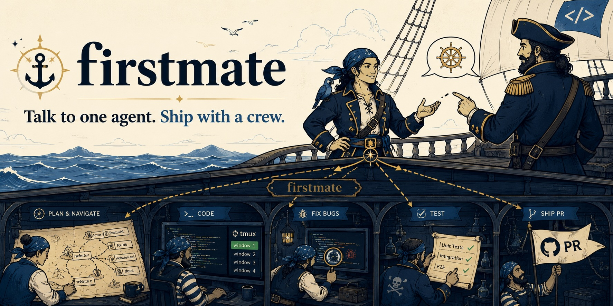

<h1 align="center">firstmate</h1>
<p align="center">
  <a
    href="https://img.shields.io/badge/platform-macOS%20%7C%20Linux-blue?style=flat-square"
    ></a>
  <a href="https://x.com/kunchenguid"
    ></a>
  <a href="https://discord.gg/Wsy2NpnZDu"
    ></a>
</p>

<h3 align="center">The only agent you need to talk to.</h3>

<p align="center">
  
</p>

You can run one coding agent well.
But the moment you want three things done in parallel, you become a tab-juggler: babysitting sessions, copy-pasting context between repos, forgetting which terminal had the failing test.

firstmate flips the model.
You talk to a single agent - the first mate - and it runs the crew for you: spawning autonomous agents in tmux windows, giving each a clean git worktree, supervising them to completion, and handing you finished PRs to merge.
There is no app to install; the whole orchestrator is an `AGENTS.md` file that any terminal coding agent can follow.

- **One liaison** — you never talk to a worker agent. The first mate dispatches, supervises, escalates only real decisions, and reports when PRs are ready.
- **A visible crew** — every crewmate lives in a tmux window in your session. Watch any of them work, or type into their window to intervene; the first mate reconciles.
- **Guarded by construction** — the first mate is read-only over your projects; crewmates work in disposable [treehouse](https://github.com/kunchenguid/treehouse) worktrees and ship through the [no-mistakes](https://github.com/kunchenguid/no-mistakes) validation pipeline. Nothing lands without a PR you merge.

## Quick Start

```sh
$ git clone https://github.com/kunchenguid/firstmate && cd firstmate
$ claude   # launch your agent harness here; AGENTS.md takes over

> ahoy! clone github.com/you/yourapp, then fix the flaky login test and add dark mode

# firstmate checks its toolchain (asking your consent before installing anything),
# clones the project under projects/, and spawns two crewmates in tmux windows
# fm-fix-login-k3 and fm-dark-mode-p7.
# Minutes later:

  PR ready for review, captain: https://github.com/you/yourapp/pull/42
  (fix flaky login test - risk: low - CI green)

> merge it
```

## Install

**Prerequisites** (the first mate detects everything else and offers to install it):

```sh
# 1. an agent harness - claude code is the verified one today
# 2. git + GitHub auth
gh auth login
```

**Get firstmate:**

```sh
git clone https://github.com/kunchenguid/firstmate
cd firstmate && claude
```

That is the whole install.
On first launch the first mate detects what its toolchain is missing (tmux, treehouse, no-mistakes, gh-axi, chrome-devtools-axi, lavish-axi), lists it with the exact install commands, and installs only after you say go.

## How It Works

```
            you (the captain)
                  │  chat: requests, decisions, "merge it"
                  ▼
 ┌─────────────────────────────────────┐
 │ firstmate            (this repo)    │
 │ reads projects/, never writes them  │
 │ backlog.md ── briefs ── watcher     │
 └──┬──────────────┬───────────────┬───┘
    │ tmux send-keys / status files │
    ▼              ▼               ▼
 ┌────────┐   ┌────────┐      ┌────────┐
 │fm-task1│   │fm-task2│  ... │fm-taskN│   tmux windows you can watch
 │crewmate│   │crewmate│      │crewmate│   one autonomous agent each
 └───┬────┘   └───┬────┘      └───┬────┘
     ▼            ▼               ▼
  treehouse worktree (clean, disposable, parallel-safe)
     │
     ▼
  /no-mistakes pipeline: review ► test ► lint ► push ► PR ► CI green
     │
     ▼
  PR for the captain ── merged ── worktree returned, window closed
```

- **Event-driven supervision** — a zero-token bash watcher (`bin/fm-watch.sh`) sleeps on the fleet and wakes the first mate only when a crewmate reports, stalls, or a PR merges. An idle crew costs you nothing.
- **Worktrees, not branches in your checkout** — crewmates never touch your clone; treehouse pools clean worktrees so parallel tasks on one repo cannot collide.
- **Validation is non-negotiable** — every project gets `no-mistakes init`; every task ends with its pipeline. Human-judgment findings escalate to you through the first mate.
- **Restart-proof** — all state lives in tmux, status files, and committed markdown. Kill the first mate session anytime; the next one reconciles and carries on.

## The bin/ toolbelt

The first mate drives these; you rarely need to, but they work by hand too.

| Script           | Description                                                                 |
| ---------------- | --------------------------------------------------------------------------- |
| `fm-spawn.sh`    | Window → treehouse worktree → agent launched with its brief                 |
| `fm-watch.sh`    | Block until a crewmate needs attention; exits with one reason line          |
| `fm-send.sh`     | Send one literal line (or `--key Escape`) to a crewmate window              |
| `fm-peek.sh`     | Print a bounded tail of a crewmate pane                                     |
| `fm-teardown.sh` | Return the worktree and kill the window; refuses if work is not on a remote |

## Configuration

The orchestrator's behavior lives in `AGENTS.md` - edit it like any prompt.
Harness support is a table in section 4 (claude is verified; codex/opencode/pi are stubs awaiting empirical verification).

Watcher tuning via environment variables:

```sh
FM_POLL=15          # seconds between watcher cycles
FM_HEARTBEAT=600    # max seconds before a mandatory fleet review
FM_CHECK_EVERY=20   # cycles between slow checks (merged-PR polls)
FM_BUSY_REGEX='esc to interrupt'   # busy-pane signatures, extend per harness
```

## Development

Tracked changes to firstmate itself, including `AGENTS.md`, `bin/`, and agent skill files, ship through the `no-mistakes` pipeline on a feature branch and require the captain's explicit merge approval.
Local `.no-mistakes/` state and test evidence stay out of this repo; `.no-mistakes.yaml` keeps evidence in a temp directory instead.

```sh
bash -n bin/*.sh                          # syntax-check the toolbelt
FM_HEARTBEAT=2 FM_POLL=1 bin/fm-watch.sh  # watcher smoke test (prints "heartbeat")
```
